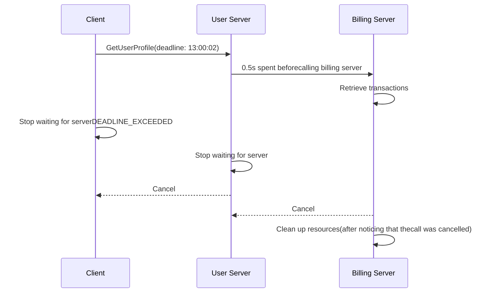

`gRPC` 作为高性能的 `RPC` 框架，超时控制是保障系统稳定性的核心机制 —— 它能避免请求无限期阻塞、防止资源泄露，同时控制服务响应的最大等待时间。

<!--more-->

[!notice] 需要注意超时控制中的两个概念 `截至时间` 和 `超时时间`，前者描述的是最晚时间点，后者描述的是可以使用的时间长度。这两个时间正常情况下可以进行相互转换，但在某些特殊情况下不能（如：测试时修改了本地时间）。

## 客户端超时控制

在 `gRPC` 的早期版本中超时控制分为 `连接超时` 和 `请求超时`，但在后续的更新中将两者统一了。客户端的超时控制是为远程调用设置一个截至时间（或最多消耗时间长度），避免产生无限制等待的情况（`gRPC` 请求的默认情况）。如何给出一个合理的超时时间需要结合一系列系统性的测试（如：网络延迟测试 、 处理时间测试等），这里就不进行展开了。这里仅仅介绍如何在客户端进行超时控制。

在 `go` 语言中，通常情况下我们通过 `context.Context` 进行超时控制，`gRPC` 对于 `go` 代码的实现也沿用了这样管理。我们可以简单的使用 `context.WithTimeout` 和 `context.WithDeadline` 以及他们的拓展函数完成超时时间的设置，示例代码如下：

```golang
...
client := hello_world.NewHelloWorldClient(cc)
ctx := context.Background()
ctx, cancel := context.WithTimeout(ctx, defaultTimeout)
defer cancel()

resp, err := client.HelloWorld(
    ctx,
    &hello_world.HelloWorldReq{
        Name: "tom",
    },
)
if err != nil {
    log.Print(status.Code(err))
    log.Fatal(err)
}
...
```

客户端超时的检测以及异常抛出在客户端进行，一旦客户端检测到远程调用超时，就主动结束本次调用并抛出 `DEADLINE_EXCEEDED` 状态信息。

> `gRPC` 客户端超时信息在传输过程中以帧字段的形式存在，`go` 语言中会转换成服务端的 `context.Contex` 上下文。

## 服务端超时控制

服务端超时控制可以分为两种情况：

- 情况一：  
  当客户端设置了一个不合理的超时时间，服务不能在截至时间时间完成远程调用的处理，默认情况下服务器会继续使用系统资源处理任务，这样会造成不必要的资源浪费，严重的情况下会造成服务器宕机。为了解决这一 `gRPC` 通过会在客户端主动结束调用这一信息告知服务端，在 `go` 语言中我们使用 `context.Context` 的 `Done` 方法来捕获这一信息：

  ```golang
    func (s *HelloWorldService) HelloWorld(ctx context.Context, req *hello_world.HelloWorldReq) (*hello_world.HelloWorldResp, error) {
        log.Printf("receive hello world request: %s", req.String())

        name := req.GetName()

        step := 6
        for s := range step {
            select {
            case <-ctx.Done():
                errMsg := ctx.Err().Error()
                log.Printf("HelloWorld任务 %s 处理超时/取消：%s", name, errMsg)
                return &hello_world.HelloWorldResp{
                    Reply: fmt.Sprintf("HelloWorld任务 %s 终止!", name),
                }, status.Error(codes.DeadlineExceeded, errMsg)
            default:
                // 模拟单步处理耗时 1 秒
                time.Sleep(1 * time.Second)
                log.Printf("任务 %s 处理第 %d 步", name, s+1)
            }
        }

        log.Println("hello world rpc complete")

        return &hello_world.HelloWorldResp{
            Reply: fmt.Sprintf("Hello %s!", name),
        }, nil
    }
  ```

- 情况二：  
  客户端设置的超时时间满足任务需求，但给出的任务规模超过了服务器预期的极限（执行时长不符合服务器预期），这时候需要服务器主动结束本次远程调用。这里的控制代码和 `gRPC` 框架关联不大，可以根据实际需求进行设计。由于这里是服务器主动结束远程调用的，所以通常使用错误状态码 `CANCELLED` 。

> `important` 服务器在远程调用时，使用了异步资源（如协程），`gRPC` 框架不会自动完成他们的回收，这里需要我们自行完成这些资源的回收。

## 服务链路中的超时控制

在实际业务中，我们的服务器常常需要其他服务器配合完成一个远程调用，这时我们的服务器作为客户端调用其他服务器的服务。一个调用任务往往存在一整个调用链，通常我们希望超时时间由最初的调用方来控制，超时控制信息沿着调用链传递。`gRPC` 为我们实现了这一功能，对于某些语言（如：`C++`）我们需要主动明确的声明开启这一功能，但对于 `java` 和 `go` 语言，这一功能是默认开启的。

> [!warning] 超时信息在 `go` 语言中以 `context.Context` 形式存在，在链路传递过程中，不建议去修改超时时间，具体在请求时设置多长的超时时间，这应该是最上游应该考虑的问题。



## 参考资料

[gRPC官方文档](https://grpc.io/docs/)  
[gRPC-go 仓库](https://github.com/grpc/grpc-go)
