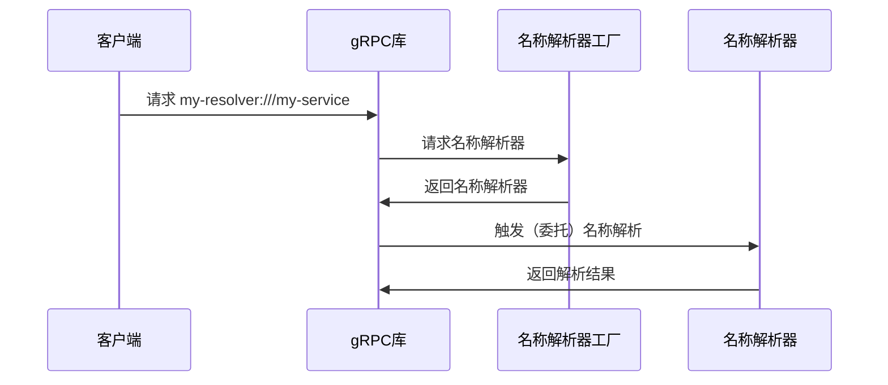

解析器（`Resolver`） 是 `gRPC` 中负责将客户端目标地址解析为具体服务器地址（`IP` + `Port`）的核心组件，它是服务发现、负载均衡以及动态更新等机制的基础。

<!--more-->

## 核心定位与作用

本质：服务发现（`Service Discovery`）的客户端实现，把逻辑服务名映射为物理网络地址。  
核心价值：

- 解耦客户端与后端实例地址，支持服务扩容 / 缩容、迁移
- 配合负载均衡策略实现流量分发
- 支持地址动态更新与健康检查
- 统一抽象，兼容 `DNS`、注册中心（`etcd/Consul/Nacos`）、服务网格（`xDS`）等多种后端

## 名称语法

`gRPC` 目标地址（`Target`）遵循 `RFC 3986 URI 规范`，格式：

```plaintext
scheme://[authority/]path[:port]
```

- `scheme`：决定使用哪个解析器（`Resolver`）；无 `scheme` 时默认 `dns`。
- `authority`：解析服务器地址（如 `DNS` 服务器、`xDS` 控制面）；留空则用 `///`。
- `path`：要解析的服务名 / 主机名。
- `port`：服务端口；如果不填写会使用默认值，具体值和 `scheme` 有关。

## 内置解析器

`gRPC` 中内置了一些常用的解析器：

| scheme      | 用途                          | 示例                                |
| :---------- | :---------------------------- | :---------------------------------- |
| DNS         | 默认 DNS 解析                 | dns:///grpc.io:50051、grpc.io:50051 |
| xDS         | 服务网格（Istio/Envoy）控制面 | xds:///my-service                   |
| Unix        | Unix 域套接字                 | unix:///run/grpc.sock               |
| Passthrough | 直连（不解析，直接返回地址）  | passthrough:///192.168.1.10:50051   |

## 自定义解析器

在开始自定义解析器前我们需要先了解一下解析器的工作机制，一次完整的名称解析流程会按照如下时序进行：



### 接口说明

根据前文中的时序图，我们不难发现，自定义解析器需要我们执行完成 解析器工厂 和 解析器 的定义。对于 `go` 来说，它们对应 `resolver.Builder` 和 `resolver.Resolver` 两个接口。

```golang
...
// Builder creates a resolver that will be used to watch name resolution updates.
type Builder interface {
	// Build creates a new resolver for the given target.
	//
	// gRPC dial calls Build synchronously, and fails if the returned error is
	// not nil.
	Build(target Target, cc ClientConn, opts BuildOptions) (Resolver, error)
	// Scheme returns the scheme supported by this resolver.  Scheme is defined
	// at https://github.com/grpc/grpc/blob/master/doc/naming.md.  The returned
	// string should not contain uppercase characters, as they will not match
	// the parsed target's scheme as defined in RFC 3986.
	Scheme() string
}
...
```

对于 `resolver.Builder` 我们需要实现两个方法：

- `Build` 根据创建客户端时传入的目标地址 `Target` 以及相关选项同步生产解析器。

  通常在 `Build` 方法中我们需要完成：
  - 首次解析：必须在 `Build` 中立即执行一次地址解析，确保客户端刚连接就能拿到可用地址；
  - 持续更新：通过协程 + 定时器 / 注册中心监听（如 `etcd watch`），实现地址的动态更新；
  - 生命周期绑定：所有后台协程必须监听 `ctx.Done()`，确保 `Resolver.Close()` 能终止协程。

  `Build` 方法包含以下参数：
  - `Target` 对目标地址名称初步解析后得到的对象。
  - `ClientConn` 用来 推送解析后的地址列表（`UpdateState`）、上报解析错误（`ReportError`）、解析服务配置（`ParseServiceConfig`）。
  - `BuildOptions` 构建解析器可选的参数，如 `TLS` 证书、自定义拨号器、认证授权信息等。

- `Scheme` 返回自定义的 `scheme` 名称。

```golang
...
// ResolveNowOptions includes additional information for ResolveNow.
type ResolveNowOptions struct{}

// Resolver watches for the updates on the specified target.
// Updates include address updates and service config updates.
type Resolver interface {
	// ResolveNow will be called by gRPC to try to resolve the target name
	// again. It's just a hint, resolver can ignore this if it's not necessary.
	//
	// It could be called multiple times concurrently.
	ResolveNow(ResolveNowOptions)
	// Close closes the resolver.
	Close()
}
...
```

对于 `resolver.Resolver` 我们需要实现两个方法：

- `ResolveNow`：执行一次解析，他可能会被 `gRPC` 并发访问。
- `Close`：关闭解析器，释放相关资源。

### 示例

这里提供一个简单的解析器示例供参考：

```golang
package main

import (
	"log"

	"google.golang.org/grpc/resolver"
)

const (
	scheme         = "test"
	serviceName    = "hello"
)

var (
	endpoints = []string{"127.0.0.1:9999", "localhost:9999"}
)

func init() {
    // 注册解析器工厂
	resolver.Register(&MyResolverBuilder{})
}

type MyResolver struct {
	service    string
	cc         resolver.ClientConn
	addrsStore map[string][]string
}

// Close implements resolver.Resolver.
func (r *MyResolver) Close() {
    // 触发资源释放 。。。
}

// ResolveNow implements resolver.Resolver.
func (r *MyResolver) ResolveNow(resolver.ResolveNowOptions) {

	addrStrs := r.addrsStore[r.service]
	addrList := make([]resolver.Address, 0, len(addrStrs))
	for _, addr := range addrStrs {
		addrList = append(addrList, resolver.Address{Addr: addr})
	}
	err := r.cc.UpdateState(resolver.State{Addresses: addrList})
	if err != nil {
		log.Fatal(err)
	}

	log.Printf("resolve receive addr list[%v]", addrList)
}

type MyResolverBuilder struct{}

// Build implements resolver.Builder.
func (b *MyResolverBuilder) Build(target resolver.Target, cc resolver.ClientConn, opts resolver.BuildOptions) (resolver.Resolver, error) {
	log.Printf("build resolver with %v", &target.URL.Path)
	r := &MyResolver{
		service: target.URL.Host,
		cc:      cc,
		addrsStore: map[string][]string{
			serviceName: endpoints,
		},
	}
	r.ResolveNow(resolver.ResolveNowOptions{})
	return r, nil
}

// Scheme implements resolver.Builder.
func (b *MyResolverBuilder) Scheme() string {
	return scheme
}

var _ resolver.Resolver = (*MyResolver)(nil)
var _ resolver.Builder = (*MyResolverBuilder)(nil)
```

使用该解析器时只需将创建客户端（`NewClient`）的 `Target` 参数替换为 `test://hello` 即可。

## 补充

除了使用内置解析器和自定义解析器外，我们还可以在社区中找到一些实现好的解析器：

- [grpc-consul-resolver](https://github.com/mbobakov/grpc-consul-resolver)：适配 `Consul` 服务注册中心的实现。

。。。

具体使用可以跳转到对应仓库自行学习。

## 参考资料

[gRPC官方文档](https://grpc.io/docs/)  
[gRPC-go 仓库](https://github.com/grpc/grpc-go)
