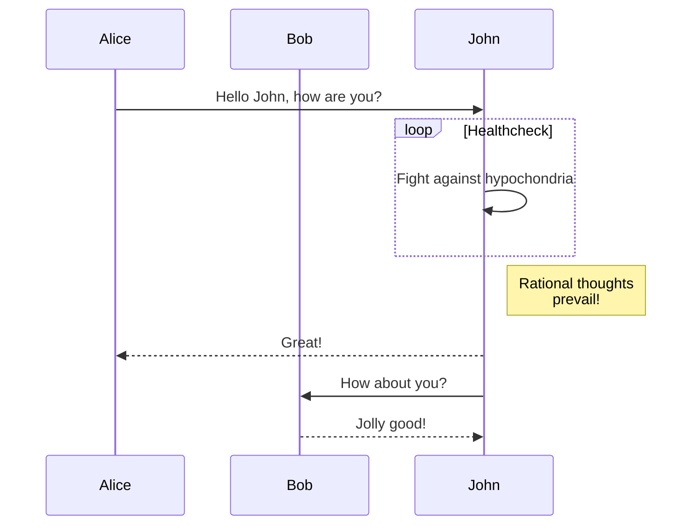

`Hugo v0.100.0` 及以上 原生默认使用 `Goldmark`（推荐），不支持直接渲染 `mermaid` 语法的代码块。本文介绍使用 `Render Hook` 方式支持 `merimaid` 渲染的方法。

## 添加钩子模板

在主题目录下添加 `layouts/_markup/render-codeblock-mermaid.html` 模板文件。具体路径需要根据不同主题确定（如： PaperModX 主题路径为 `layouts/_default/_markup/render-codeblock-mermaid.html`）  
模板内容如下：

```go-template-html
<pre class="mermaid">
  {{ .Inner | htmlEscape | safeHTML }}
</pre>
{{ .Page.Store.Set "hasMermaid" true }}
```

其中 `pre` 标签包裹的是 `mermaid` 代码内容。而 `{{ .Page.Store.Set "hasMermaid" true }}` 是用来标记本页面中包含 `mermaid` 代码，用来确定是否需要加载 `mermaid` 渲染库。

## 修改基础模板

在主题目录下找到 `layouts/baseof.html` 基础模板文件，在 `body` 的关闭标签前加入以下代码段：

```go-template-html
{{ if .Store.Get "hasMermaid" }}
  <script type="module">
    import mermaid from 'https://cdn.jsdelivr.net/npm/mermaid/dist/mermaid.esm.min.mjs';
    mermaid.initialize({ startOnLoad: true });
  </script>
{{ end }}
```

`{{ if .Store.Get "hasMermaid" }}` 获取页面内是否包含 `mermaid` 代码块，如果包含则加载渲染库。

## 测试文件

如果看到 `mermaid` 代码块被渲染成图表则说明配置成功了。




## 参考资料

[Hugo 官方文档](https://gohugo.io/)
