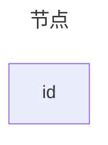
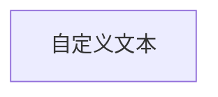
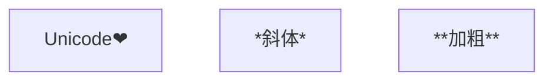
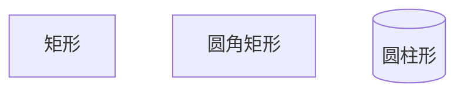
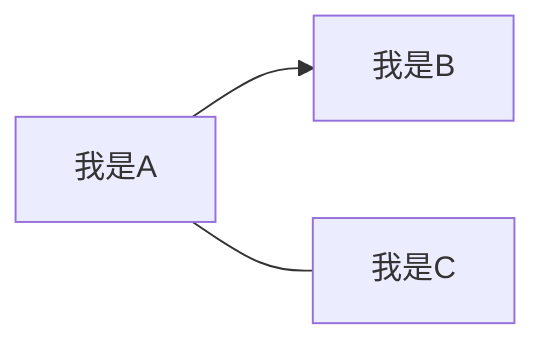
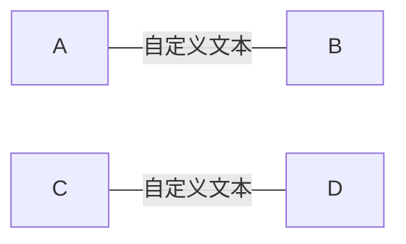
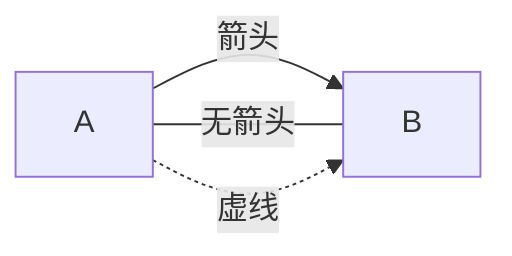
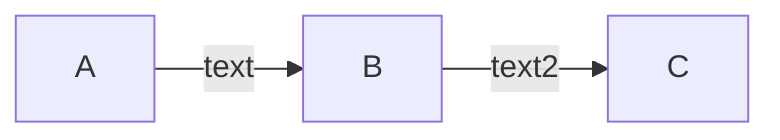
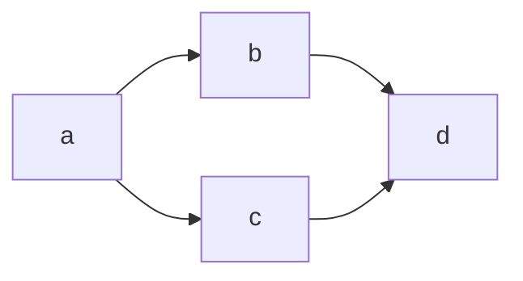
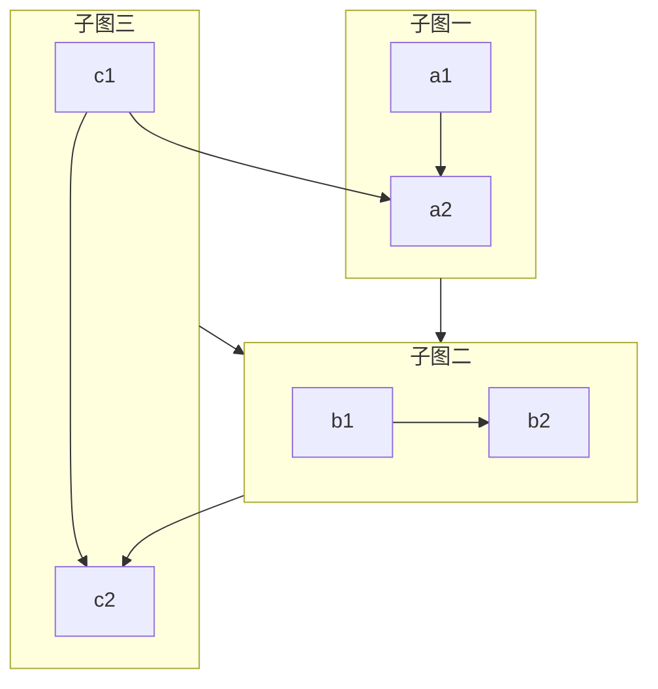

`Mermaid` 是一个基于 `JavaScript` 的开源图表绘制工具，可自动渲染为流程图、时序图等多种可视化图形。

<!--more-->

`Mermaid` 以类 `Markdown` 的纯文本语法定义图表，适配 `Git` 版本管理与主流文档 / 开发工具，实现 “图表即代码（`Diagram as Code`）”，大幅提升文档中图表的维护效率与协作体验。

## 基础使用

只须将 `mermaid.min.js` 引入到网页中，完成初始化，`mermaid` 就能自动完成对 `mermaid` 类的渲染：

```html
<script src="https://cdn.jsdelivr.net/npm/mermaid/dist/mermaid.min.js"></script>
<script>
  mermaid.initialize({ startOnLoad: true });
</script>
<div class="mermaid">flowchart LR A[你] --> B[学会Mermaid] --> C[高效画图]</div>
```

这里仅介绍最基础的使用，如果有其他使用需求，可以参考 [官方文档](https://mermaid.js.org/intro/)

## 流程图 Flowcharts

在 `Mermaid` 中流程图的基本组成单元为 节点 以及 连接节点的 边。

### 节点

> 这里的 `flowchart` 也会有替换为 `graph`

```code
---
title: 节点
---
flowchart TB
    id
```



定义节点的时候，我们可以为节点添加自定义文本，如果没有则会采用默认的边框并使用其 `id` 作为节点文本。

```code
---
title: 自定义文本节点
---
flowchart LR
    id1[自定义文本]
```



自定文本支持 `Unicode` 符号 以及 `mermaid` 样式语法：

> 为了避免一些符号引起渲染异常，推荐用引号包裹自定义文本

```code
flowchart TB
    id1["Unicode❤"]
    id2["*斜体*"]
    id3["**加粗**"]
```



节点还可以修改外框形状，通过修改括号类型控制：

```code
flowchart TB
    id1[矩形]
    id2[圆角矩形]
    id3[(圆柱形)]
```



补充一些支持的形状：

- 子程序：`[[ xxx ]]`
- 椭圆形：`([ xxx ])`
- 正圆形：`(( xxx ))`
- 书签：`> xxx ]`
- 菱形：`{ xxx }`
- 六边形：`{{ xxx }}`
- 平行四边形：`[/ xxx /]` `[\ xxx \]`
- 梯形：`[/ xxx \]` `[\ xxx /]`
- 双圆形：`((( xxx )))`

### 边

我们可以在定义节点时候添加边，一个利用节点的 `id` 为它们添加边。

```code
flowchart LR
    A["我是A"]-->B["我是B"]
    C["我是C"]

    A---C
```



对于边，我们可为它设置自定义标签，一下两种方法都是可行的。

```code
flowchart LR
    A-- 自定义文本 ---B
    C---|自定义文本|D
```



边同样有多种样式可供选择：

```code
flowchart LR
    A-->|箭头|B
    A ---|无箭头|B
    A -.->|虚线|B
```



补充：

> [!important] 边的标签开头包含 `o` 或 `x` 需要注意语法冲突

- 加粗箭头： `==>`
- 隐藏边： `~~~`
- 圈箭头：`--o`
- 叉箭头：`--x`
- 双向箭头：

  ```code
  flowchart LR
  A o--o B
  B <--> C
  C x--x D
  ```

  ```mermaid
  flowchart LR
  A o--o B
  B <--> C
  C x--x D
  ```

控制边长度：

| 长度排名   | 最短 | 中等  | 最长   |
| :--------- | :--- | :---- | :----- |
| 普通边     | ---  | ----  | -----  |
| 带箭头     | -->  | --->  | ---->  |
| 粗边       | ===  | ====  | =====  |
| 带箭头粗边 | ==>  | ===>  | ====>  |
| 虚线       | -.-  | -..-  | -...-  |
| 带箭头虚线 | -.-> | -..-> | -...-> |

支持链式连接：

```code
flowchart LR
   A -- text --> B -- text2 --> C

```



支持一行中连接多个节点：

```code
flowchart LR
   a --> b & c--> d

```



### 渲染方向

`flowchart` 后接着的两个大写字母表示流程图的渲染方向，支持以下几种配置:

- TB/TD: 从上到下
- BT: 从下到上
- RL: 从右到左
- LR: 从左到右

### 子图

定义子图

```code
subgraph 子图id[子图标题]
    图内容 （定义方式同主图）
end
```

示例

```code
flowchart TB
    c1-->a2
    subgraph one[子图一]
    a1-->a2
    end
    subgraph two[子图二]
    b1-->b2
    end
    subgraph three[子图三]
    c1-->c2
    end
    one --> two
    three --> two
    two --> c2
```



我们可以通过添加 `direction TB` 控制子图内的渲染方向，但需要注意：如果子图中的节点有对外连接的边则子图的方向配置会失效。

```code
subgraph subgraph1
    direction TB
    top1[top] --> bottom1[bottom]
end
```

## 未完待续

## 参考资料

[Mermaid 官方文档](https://mermaid.js.org/intro/)
